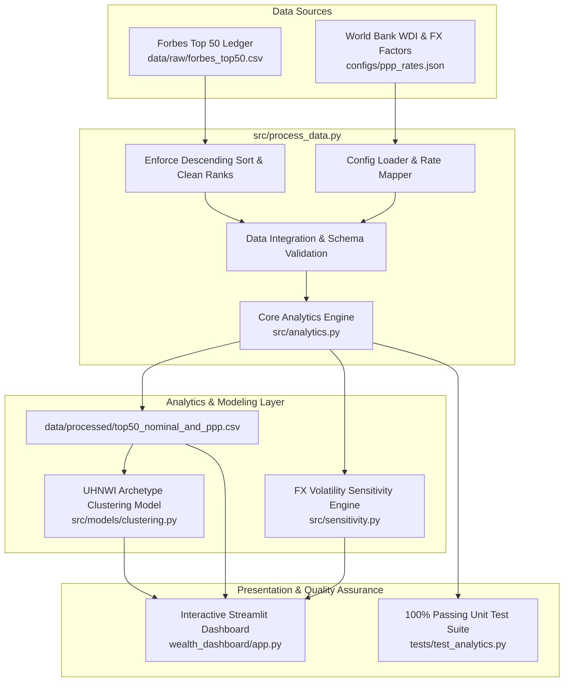

# RealRich: UHNWI Wealth Econometrics & Purchasing Power Parity (PPP) Analytics

[](https://www.python.org/)
[](tests/)
[](wealth_dashboard/)
[](LICENSE)

> **Institutional-grade quantitative analytics, econometrics, and unsupervised machine learning platform that evaluates global wealth inequality by adjusting Ultra-High-Net-Worth Individual (UHNWI) net worth for sovereign Purchasing Power Parity (PPP), foreign exchange differentials, and macroeconomic price structures.**

---

## 📌 Problem Formulation & Economic Context

Standard global wealth benchmarks (e.g., Forbes Real-Time, Bloomberg Billionaires) measure net worth strictly in nominal US Dollars converted at spot foreign exchange rates. While suitable for cross-border financial transactions and liquid capital markets, this metric introduces severe **geographic purchasing power bias**:

1. **The Domestic Labor & Capital Arbitrage Disparity:** $1 Billion USD in Mumbai, Jakarta, or Beijing commands substantially more domestic labor, physical infrastructure, utilities, and commercial real estate than $1 Billion USD in San Francisco, London, or Zurich.
2. **The Sovereign Resource Gap:** Sovereign influence and domestic economic dominance depend heavily on the local cost structure of the country where an individual's primary operational assets and political power reside.
3. **The Analytic Deficit:** Conventional wealth rankings fail to quantify how domestic price levels distort real economic capacity, and rarely provide sensitivity modeling for currency volatility.

**RealRich addresses this gap** by establishing a reproducible econometric pipeline that converts nominal wealth into **International Dollars (Int\$)**, computes rank displacement volatility, stress-tests rankings against currency fluctuations, and clusters billionaires into macroeconomic wealth archetypes via unsupervised machine learning.

---

## 🔬 Core Mathematical Methodology

### 1. Purchasing Power Parity (PPP) Conversion
Purchasing power parity adjusts nominal net worth by accounting for the price level of a standardized basket of goods and services:

$$\text{Domestic Net Worth (LCU)} = W_{\text{USD}} \times E_{\text{LCU/USD}}$$

$$\text{Real PPP Wealth (Int\$)} = \frac{\text{Domestic Net Worth (LCU)}}{P_{\text{PPP}}} = W_{\text{USD}} \times \left(\frac{E_{\text{LCU/USD}}}{P_{\text{PPP}}}\right)$$

Where:
* $W_{\text{USD}}$: Nominal Net Worth in Billions USD
* $E_{\text{LCU/USD}}$: Market Exchange Rate (Local Currency Units per USD)
* $P_{\text{PPP}}$: World Bank PPP Conversion Factor (Local Currency Units per International Dollar)
* $\mu = \frac{E_{\text{LCU/USD}}}{P_{\text{PPP}}}$: **PPP Wealth Multiplier**

### 2. Relative Purchasing Power Uplift
$$\Delta W_{\%} = \left(\frac{\text{Real PPP Wealth} - W_{\text{USD}}}{W_{\text{USD}}}\right) \times 100\% = (\mu - 1) \times 100\%$$

* If $\mu > 1$ (e.g., India $\mu \approx 4.08$, China $\mu \approx 2.06$): Local currency is undervalued relative to consumer/capital price indices; **Domestic Purchasing Power Expands**.
* If $\mu = 1$ (e.g., United States baseline): Parity baseline; **Uplift is 0%**.

### 3. Rank Shift Dynamics
$$\Delta R = R_{\text{Nominal}} - R_{\text{PPP}}$$
* $\Delta R > 0$: Individual improves their global standing when measured in real domestic terms (e.g., moving from #13 to #3 corresponds to $\Delta R = +10$).

---

## 🏗️ System Architecture & Data Flow



---

## 💡 Key Analytical Findings

| Region / Economy | Typical PPP Multiplier ($\mu$) | Average Uplift (%) | Representative Movers | Strategic Interpretation |
| :--- | :---: | :---: | :--- | :--- |
| **India** | **~4.08x** | **+308%** | Mukesh Ambani, Gautam Adani | Tremendous domestic capital power; $1B commands >$4B in local resources, propelling Ambani into the global Top 3 in real spending capacity. |
| **Indonesia** | **~3.42x** | **+242%** | Low Tuck Kwong, Hartono brothers | Extreme domestic labor and operational cost advantage in extractive/conglomerate sectors. |
| **China** | **~2.06x** | **+106%** | Zhong Shanshan, Zhang Yiming, Colin Huang | Substantial real resource multiplication across tech, consumer electronics, and manufacturing. |
| **Eurozone / UK** | **1.0x – 1.3x** | **0% – +30%** | Bernard Arnault, Amancio Ortega | Modest variance; Western European economies closely track global dollar price levels with Southern Europe seeing mild uplift. |
| **United States** | **1.00x** | **0.0%** | Elon Musk, Jeff Bezos, Mark Zuckerberg | Global baseline anchor. Nominal dollar net worth represents identical domestic purchasing power. |

---

## 🤖 Machine Learning: UHNWI Wealth Archetype Segmentation

Implemented in [`src/models/clustering.py`](src/models/clustering.py), an unsupervised **K-Means clustering algorithm with standard feature normalization (`StandardScaler`)** categorizes the global billionaire cohort into 3 distinct macroeconomic archetypes:

```
[Normalized Features]
  ├── Nominal Net Worth ($B)
  ├── Real PPP Net Worth (Int$ B)
  └── PPP Uplift Percentage (%)
       │
       ▼
  [K-Means Clustering (k=3, random_state=42)]
       │
       ├── Cluster 1: Emerging PPP Beneficiaries
       │   └── High PPP uplift (+100% to +300%), moderate nominal base ($30B–$110B).
       ├── Cluster 2: Established Global Elite
       │   └── High-income economies (US, Europe), near-zero uplift, high liquidity.
       └── Cluster 3: Ultra-High Net Worth Titans
           └── Outlier wealth (> $150B) commanding massive global and domestic influence.
```

---

## 📊 Interactive BI Suite (`dashboard/app.py`)

The project includes an enterprise-grade, dark-themed Streamlit application structured into 5 analytical views:

1. **Market Overview:** Side-by-side grouped horizontal bar charts comparing nominal vs. PPP wealth, paired with an annotated 1:1 parity scatter plot.
2. **Analytical Deep Dive:** Horizontal divergence charts displaying relative uplift percentage and a rank-volatility ladder (`Rank Change`).
3. **Geographic Impact:** Sovereign aggregation displaying average national uplift alongside an interactive country wealth-share distribution.
4. **Sensitivity Analysis:** Interactive what-if simulation enabling dynamic testing of FX rate shocks ($\pm 5\%$ to $\pm 30\%$) and rank resilience.
5. **Data Explorer:** Fully sortable, search-filtered dataset with directional styling and one-click CSV export.

---

## 📁 Repository Structure

```
realrich-ppp/
├── configs/
│   └── ppp_rates.json                  # Sovereign exchange rates & World Bank PPP conversion factors
├── dashboard/
│   ├── app.py                          # 5-tab production Streamlit BI application
│   ├── requirements.txt                # Dashboard dependencies
│   ├── assets/theme.css                # Dark UI custom styling
│   └── README.md                       # Dashboard documentation
├── data/
│   ├── raw/
│   │   └── forbes_top50.csv            # Validated and strictly sorted raw Forbes dataset
│   ├── processed/
│   │   └── top50_nominal_and_ppp.csv   # Standardized master dataset with calculated PPP metrics
│   └── output/
│       └── top50_nominal_and_ppp.csv   # Production export snapshot
├── docs/
│   └── analysis_summary.md             # Detailed macroeconomic analysis summary
├── notebooks/
│   └── billionaire_ppp_analysis.ipynb  # Interactive analytical & visualization notebook
├── reports/
│   ├── report.md                       # Comprehensive economic whitepaper
│   ├── rankings_tables.md              # Formatted markdown ranking tables
│   ├── top_movers_summary.md           # Top rank movers executive briefing
│   └── figures/                        # High-resolution generated charts
├── src/
│   ├── analytics.py                    # Core PPP conversion & rank-shift mathematics
│   ├── sensitivity.py                  # Macroeconomic FX sensitivity & volatility engine
│   ├── process_data.py                 # End-to-end data processing and validation pipeline
│   └── models/
│       └── clustering.py               # ML UHNWI archetype segmentation (K-Means)
├── tests/
│   └── test_analytics.py               # Pytest suite with 10 passing unit tests (100% pass rate)
├── .gitignore                          # Clean Python/Data ignore rules
├── LICENSE                             # MIT Open Source License
├── requirements.txt                    # Project dependencies for local & Streamlit Cloud deployment
└── README.md                           # Flagship technical documentation
```

---

## ⚡ Quickstart & Reproduction Guide

### 1. Environment Setup
```bash
# Clone repository
git clone https://github.com/DKS-MANAGER/realrich_PPP.git
cd realrich_PPP

# Create and activate virtual environment
python -m venv .venv
source .venv/bin/activate  # Windows: .venv\Scripts\activate

# Install dependencies
pip install pandas numpy scikit-learn plotly streamlit pytest
```

### 2. Execute Automated Unit Tests
```bash
python -m pytest tests/ -v
```
*Executes all 10 unit tests verifying baseline US parity, emerging market multiplier bounds, output column schemas, zero-NaN data contracts, and directional FX sensitivity.*

### 3. Run Data Processing Pipeline
```bash
python src/process_data.py
```
*Validates raw data sorting, joins sovereign PPP factors, computes real international dollar valuations, and outputs processed datasets to `data/processed/`.*

### 4. Launch Interactive Analytics Dashboard
```bash
streamlit run dashboard/app.py
```
*Opens the BI application in your browser at `http://localhost:8501`.*

---

## ⚠️ Limitations & Methodological Considerations

* **Consumer Basket vs. Capital Goods Friction:** World Bank PPP factors measure a standard household consumption basket (housing, food, transport, medical care). While relevant to local operational expenditures and political capital, billionaires predominantly hold equity in multinational corporations and globally priced assets (luxury real estate, private aviation) that trade at dollar parity regardless of geography.
* **Point-in-Time Net Worth Volatility:** Billionaire equity valuations fluctuate daily with capital market swings. Figures represent a synchronized point-in-time snapshot (January 2026).
* **Asset Fungibility:** The model assumes domestic residence reflects the primary operational sphere; billionaires with multinational asset diversification experience lower effective domestic purchasing power gains than local holding structures dictate.

---

## 📜 License & Citation

Distributed under the **MIT License**. See `LICENSE` for more information.

**Data Citations:**
* *Forbes Real-Time Billionaires Index* (2026 Snapshot)
* *World Bank World Development Indicators (WDI)*, International Comparison Program (ICP), Indicator: `PA.NUS.PPP`.
