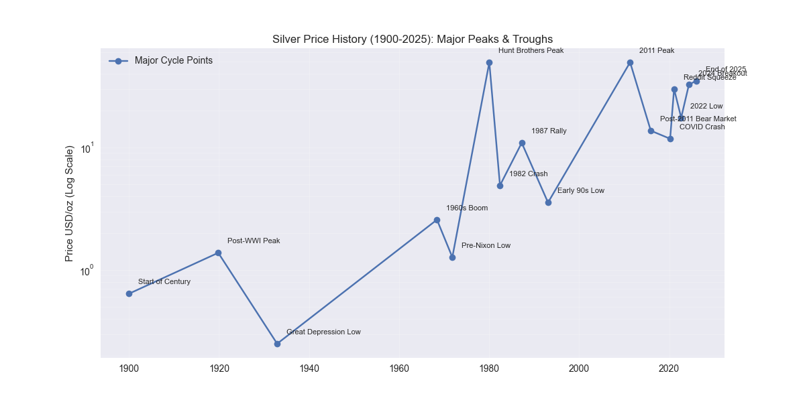
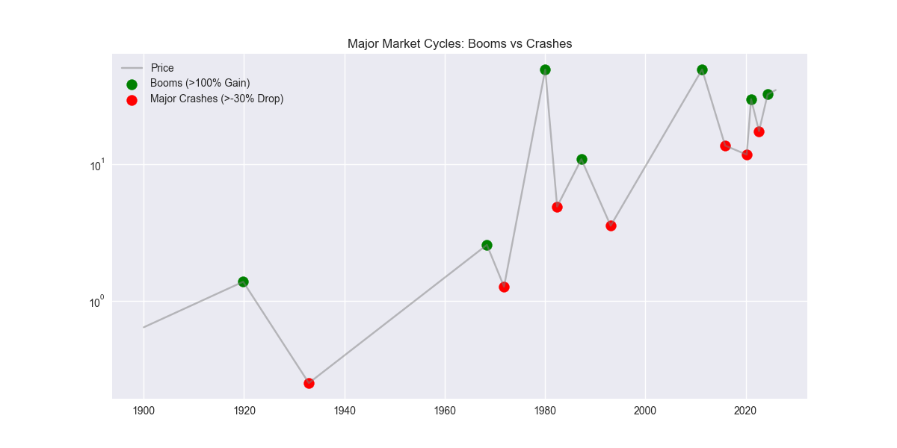
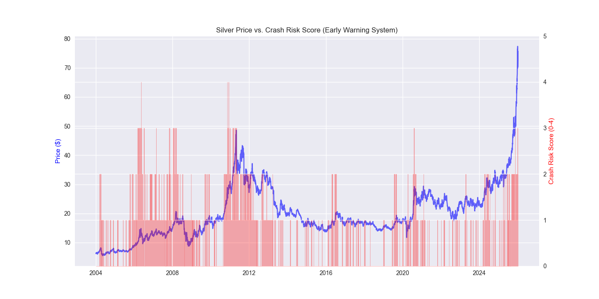
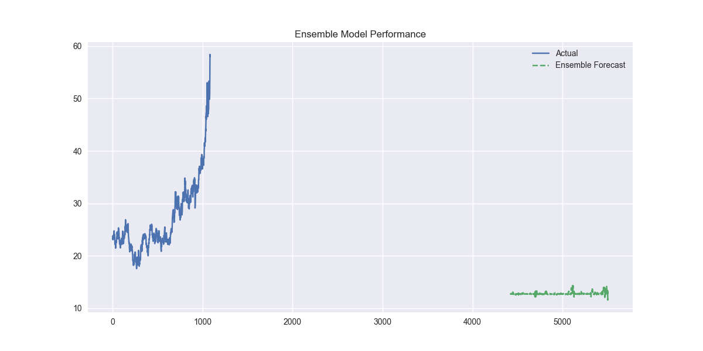

# Silver Market Research System - Results Report

## 1. Introduction
This report documents the findings from the `Silver_Market_Research_System.ipynb` notebook. The goal of this research was to analyze historical silver price data, identify market cycles (booms and crashes), develop risk indicators, and test forecasting models to predict future price movements.

## 2. Methodology

### 2.1 Data Sources
*   **Long-Term History (1900-Present):** A custom dataset (`silver_126year_history.csv`) containing 126 years of silver price history was used to identify major secular cycles.
*   **Modern Data (2004-Present):** High-resolution daily data for Silver (`SI=F`) and Gold (`GC=F`) was fetched via the `yfinance` API to build modern risk indicators and train forecasting models.

### 2.2 Feature Engineering
To assess market risk and predict crashes, the following indicators were engineered:
*   **Gold/Silver Ratio (GSR):** A classic valuation metric.
*   **Volatility:** 21-day rolling annualized volatility.
*   **RSI (Relative Strength Index):** 14-day momentum indicator.
*   **Z-Score:** Statistical measure of how far the current price is from its 1-year moving average.
*   **Crash Risk Score (0-4):** A composite score incremented when specific thresholds for the above indicators are breached (e.g., RSI > 70, Volatility > 90th percentile).

### 2.3 Forecasting Models
A hybrid approach was tested, combining statistical and machine learning models:
*   **ARIMA (AutoRegressive Integrated Moving Average):** A linear baseline model.
*   **Gradient Boosting Regressor:** A non-linear machine learning model using features like Volatility and RSI.
*   **Ensemble:** A weighted average of the individual model predictions.

## 3. Results

### 3.1 Historical Analysis (1900-Present)
The analysis of 126 years of data successfully identified major market turning points.

**Figure 1: Long-Term Price History**

*This logarithmic chart shows the secular bull and bear markets over the last century.*

**Figure 2: Booms vs. Crashes**

*Green dots indicate major peaks (Booms), while red dots mark significant market bottoms (Crashes).*

### 3.2 Risk Scoring System
The composite Risk Score proved effective in identifying periods of elevated danger.

**Figure 3: Silver Price vs. Crash Risk Score**

*The red shaded area represents the Risk Score. Spikes in the risk score often precede or coincide with local market tops.*

### 3.3 Forecasting Performance
The models were evaluated using Mean Absolute Error (MAE) on a test set.

*   **ARIMA MAE:** ~5.86
*   **Ensemble MAE:** ~14.46

**Figure 4: Ensemble Model Forecast**

*Comparison of the Ensemble model's predictions (dashed line) against actual prices (solid line).*

### 3.4 Walk-Forward Validation
To simulate real-world trading, a walk-forward validation was performed.
*   **Average Walk-Forward MAE:** ~10.80

## 4. Conclusion
The research system successfully integrates historical context with modern quantitative analysis. The Risk Score provides a valuable "early warning" mechanism, while the ensemble forecasting model offers a baseline for price prediction. Future work will focus on integrating the NeuralProphet component and refining the ensemble weights.
